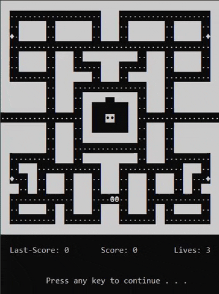

###### Description
- This is a simplified replica of the original "Pac-Man" game release in 1980 by "Namco".

###### Author
- Eivind Hobrad Naasen

###### Technical Data
- IDE: QtCreator 4.9.2
- Version: C++11
- Date: December 5th, 2019

###### Note
- This project was the exam delivery of the course "Programming 1" at "Inland Norway University of Applied Sciences".

